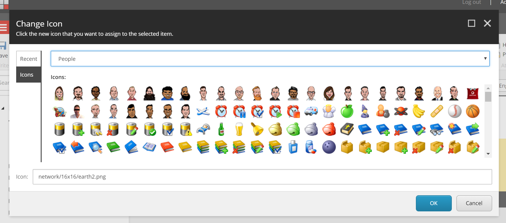

# MVP People Icons

Ever wanted some extra "people" icons for your Sitecore instances? Cartoons of MVPs? St Arnold (<a href="https://www.saintarnold.com/year-round-beers/#lawnmower">of lawnmower fame</a>)? The Sitecore Pillow? Bobby Hack? Well, now you can...

## Installing

For the moment, it's not automated. To add these files to an instance of Sitecore you need to:

1. Grab a copy of the "`<size>x<size>`" folders under the "`People`" folder in the repo above.
2. Find "`People.zip`" in your "`<instance>\Website\sitecore\shell\Themes\Standard`" folder and open it. (You may wish to back this file up before you change anything)
3. Paste the new folders into that zip, so that they add to the similarly named existing folders that are in it already.
4. Delete anything in your "`<instance>\Website\temp\IconCache`" folder if it exists.
5. Delete the "`<instance>\Website\temp\icons_People.*`" files, if they exist.

And then when you go to the "Set Icon" dialog in Content Editor, you should see the new Icons in the People section.

(Remember that you'll need to deploy these icons to any other platforms you deploy your site too)